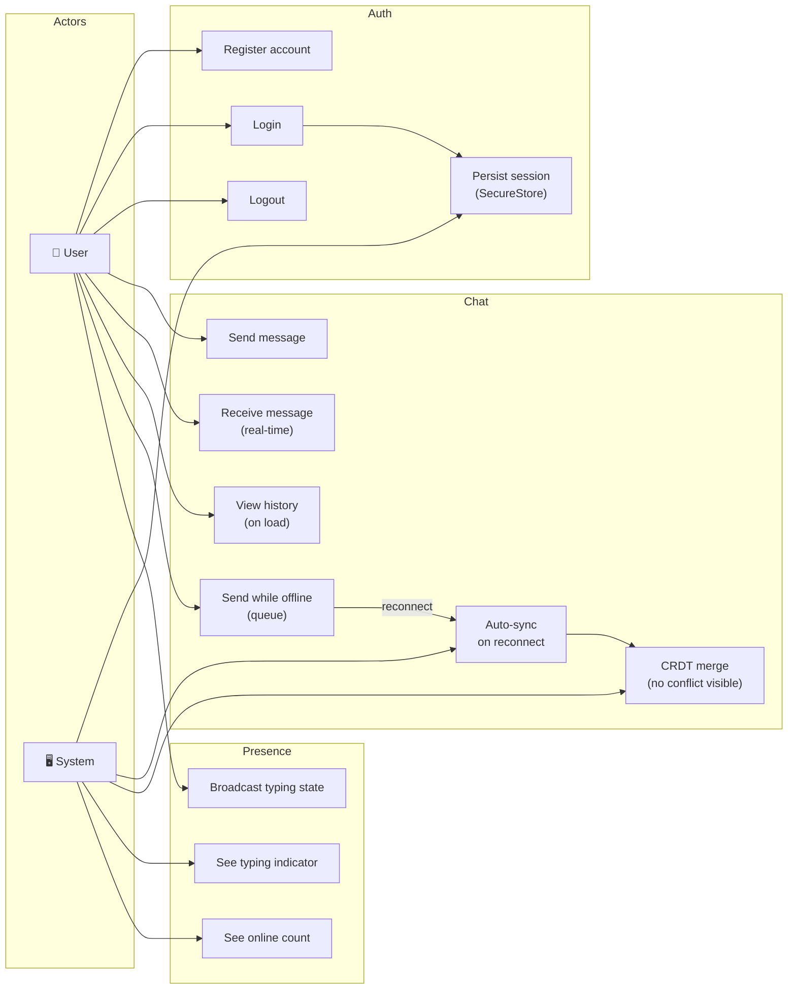
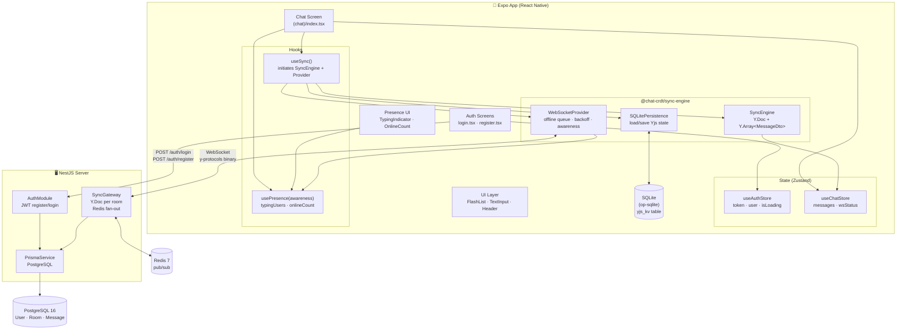
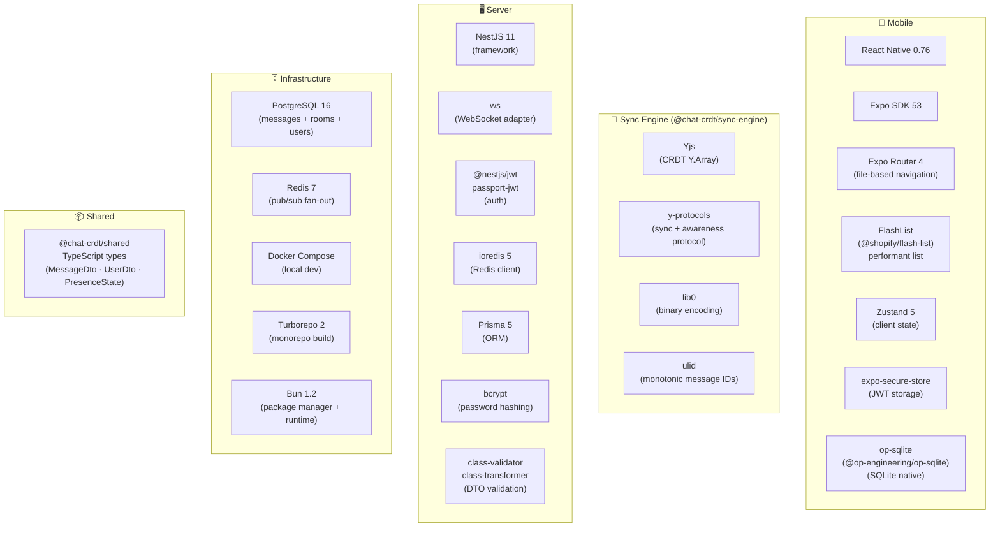
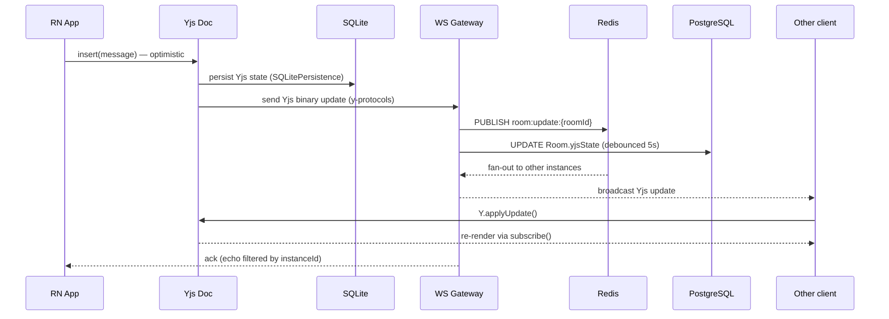
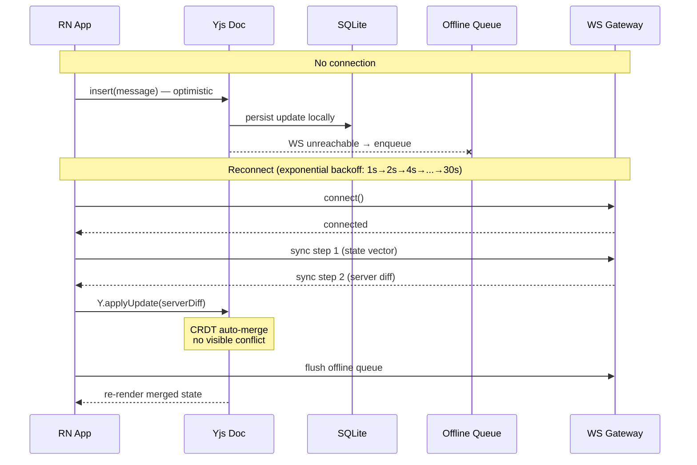
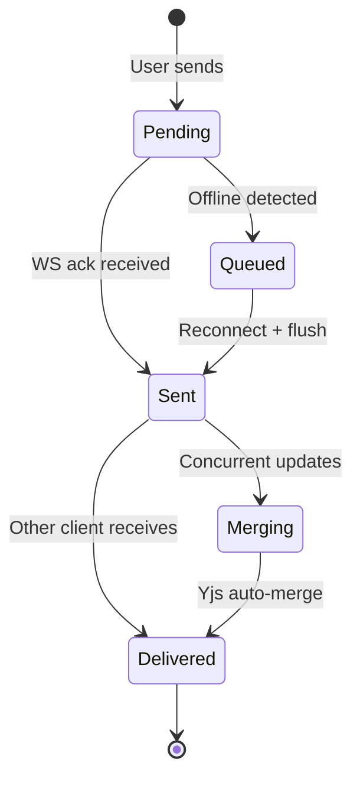
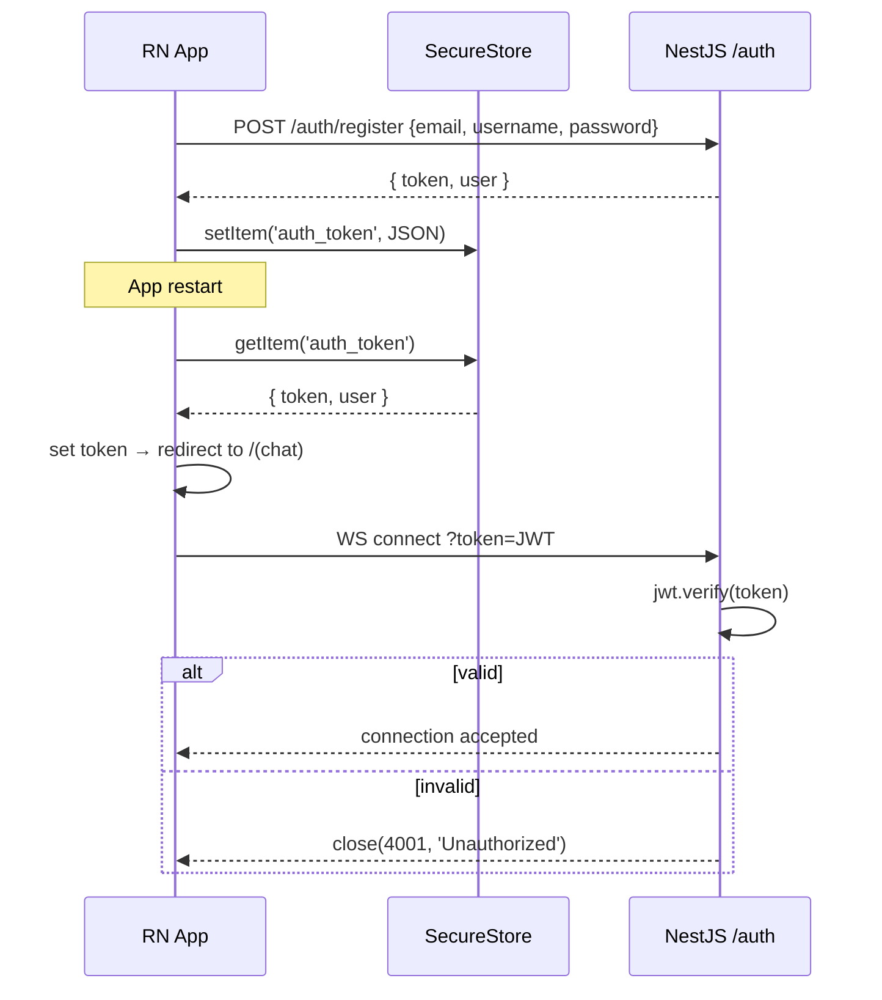
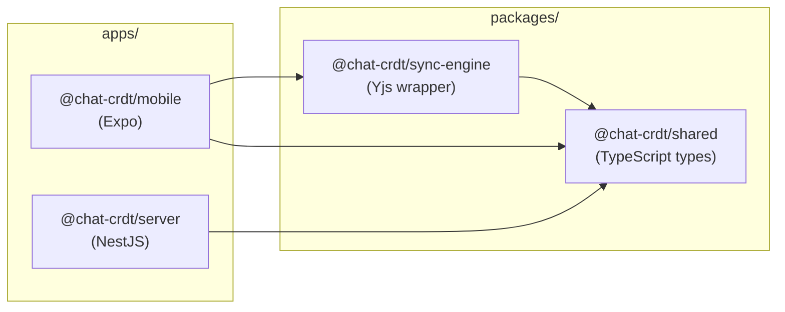

# Chat CRDT — Diagrams

---

## 1 — Use Cases

---

## 2 — Component Architecture

---

## 3 — Tech Stack

---

## 4 — Online Message Flow

---

## 5 — Offline → Reconnect → CRDT Merge

---

## 6 — Message State Machine

---

## 7 — Auth Flow

---

## 8 — Monorepo Package Graph

